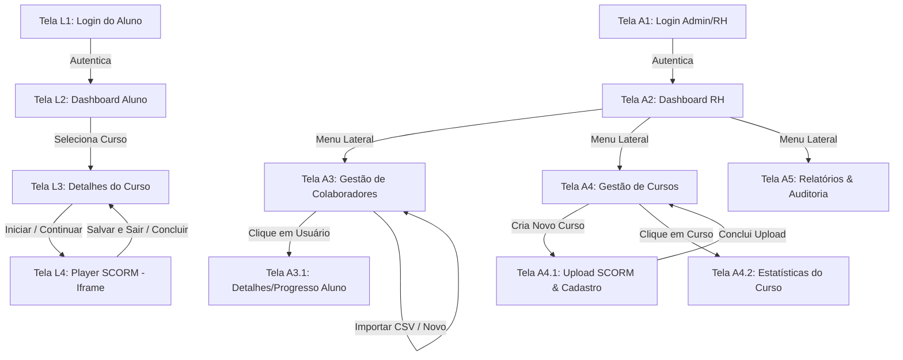

# Fluxo de Navegação e Telas: Aluno vs RH

Este documento descreve detalhadamente a jornada de navegação (User Flow) para os perfis de **Aluno** e de **RH**, mapeando o que o usuário vê em cada tela, quais são as ações disponíveis e para onde ele é direcionado ao clicar nos elementos.

---

## 1. Fluxo de Navegação Geral

O diagrama abaixo ilustra como as telas se conectam em ambos os portais:

---

## 2. Detalhamento das Telas: Portal do Aluno (Learner)

### Tela L1: Login do Aluno (`/[tenant]/login`)
*   **O que o Aluno vê:**
    *   Logo da empresa contratante (dinâmico via banco).
    *   Formulário de login simples: E-mail e Senha.
    *   Cores da interface adaptadas à identidade visual do cliente (ex: cor primária azul para Empresa A, verde para Empresa B).
*   **Ações e Destinos:**
    *   **Clicar em "Entrar"**: Valida os dados, gera a sessão segura (JWT) e redireciona para a **Tela L2 (Dashboard Aluno)**.

### Tela L2: Dashboard do Aluno (`/[tenant]/dashboard`)
*   **O que o Aluno vê:**
    *   Menu lateral: "Meus Cursos", "Meu Perfil", "Sair".
    *   Saudação personalizada: *"Olá, [Nome do Aluno]! Bom ver você por aqui."*
    *   Barra de progresso geral do mês (ex: "Você concluiu 2 de 5 treinamentos obrigatórios").
    *   Grid de cards de cursos. Cada card exibe: imagem de capa, título do curso, prazo limite de conclusão e uma barra de progresso individual.
    *   Abas de filtro de cursos: **"Não Iniciados"**, **"Em Progresso"**, **"Concluídos"**.
*   **Ações e Destinos:**
    *   **Clicar no card de um curso**: Redireciona para a **Tela L3 (Detalhes do Curso)**.

### Tela L3: Detalhes do Curso (`/[tenant]/courses/[courseId]`)
*   **O que o Aluno vê:**
    *   Caminho de navegação (Breadcrumbs): *Início > Cursos > Segurança do Trabalho*.
    *   Título e descrição detalhada do treinamento.
    *   Carga horária estimada, data de atribuição e data limite.
    *   Histórico de tentativas (caso o aluno já tenha jogado e queira ver pontuações passadas).
    *   Botão principal destacado: **"Iniciar Curso"** (se não iniciado) ou **"Continuar de onde parei"** (se em progresso). Se concluído, exibe **"Refazer Curso"**.
*   **Ações e Destinos:**
    *   **Clicar em "Iniciar / Continuar"**: Abre a **Tela L4 (Player SCORM)**.
    *   **Clicar em "Voltar"**: Retorna ao **Dashboard (Tela L2)**.

### Tela L4: Player SCORM (`/[tenant]/player/[enrollmentId]`)
*   **O que o Aluno vê:**
    *   Layout "Modo Teatro" (sem distrações, menu lateral oculto).
    *   Barra superior fixa contendo:
        *   Título do curso.
        *   Barra de progresso de slides (atualizada se o SCORM enviar a porcentagem).
        *   Botão **"Salvar e Sair"**.
    *   Área central: O `<iframe>` que carrega o curso SCORM estático do R2.
*   **Ações e Destinos:**
    *   **Interagir com o curso**: Conforme o aluno clica nos slides e responde perguntas, o script JavaScript invisível (`window.API`) recebe e armazena os dados.
    *   **Clicar em "Salvar e Sair"**: Dispara a gravação final (`LMSCommit` + `LMSFinish`), encerra o iframe de forma segura e redireciona de volta para a **Tela L3 (Detalhes do Curso)** atualizada.
    *   **Finalizar o Curso**: Quando o curso chega no último slide e dispara `LMSSetValue("cmi.core.lesson_status", "completed")`, a barra superior exibe um alerta de "Curso Concluído com Sucesso!" e o player redireciona o aluno de volta para a **Tela L3 (Detalhes do Curso)**.

---

## 3. Detalhamento das Telas: Portal do RH (Admin)

### Tela A1: Login Admin/RH (`/[tenant]/admin/login`)
*   **O que o RH vê:**
    *   Interface corporativa sobria, formulário de E-mail e Senha.
*   **Ações e Destinos:**
    *   **Clicar em "Entrar"**: Valida se o usuário tem a permissão (`Role == 'RH'`), e o direciona para o **Dashboard Administrativo (Tela A2)**.

### Tela A2: Dashboard Geral do RH (`/[tenant]/admin`)
*   **O que o RH vê:**
    *   Menu lateral persistente: "Dashboard", "Colaboradores", "Treinamentos", "Relatórios", "Configurações da Empresa".
    *   Indicadores rápidos (Cards numéricos):
        *   *Total de Colaboradores:* [Número] (+X este mês)
        *   *Treinamentos Obrigatórios Ativos:* [Número]
        *   *Taxa de Adesão Geral:* [85%]
        *   *Cursos Concluídos:* [Número]
    *   Gráficos:
        *   Gráfico de barras: Progresso de conclusão comparado por Departamento (ex: TI com 90%, Vendas com 45%).
        *   Gráfico de linha: Horas de estudo registradas por semana.
    *   Painel de Atividades Recentes: feed em tempo real de quem iniciou ou concluiu cursos.
*   **Ações e Destinos:**
    *   Navegação pelos links do menu lateral para acessar as respectivas telas de gestão.

### Tela A3: Gestão de Colaboradores (`/[tenant]/admin/users`)
*   **O que o RH vê:**
    *   Barra de ferramentas superior com busca textual, filtro por Departamento e botão **"Adicionar Colaborador"** e **"Importar Planilha CSV"**.
    *   Tabela principal com colunas: Nome, E-mail, Departamento, Cargo, Data de Cadastro, Status (Ativo/Inativo).
*   **Ações e Destinos:**
    *   **Clicar em "Adicionar Colaborador"**: Abre um formulário lateral (Drawer) com campos: Nome, E-mail, Senha Provisória, Cargo e Departamento. Salvar adiciona o usuário no banco.
    *   **Clicar em "Importar Planilha CSV"**: Abre modal para subir o arquivo. O sistema processa e exibe uma tela com os usuários importados com sucesso.
    *   **Clicar na linha de um colaborador**: Direciona para a **Tela A3.1 (Detalhes do Aluno)**.

#### Tela A3.1: Detalhes do Colaborador
*   Visualiza a ficha cadastral do aluno e uma tabela com o progresso individual de cada curso atribuído a ele (Histórico de tentativas, nota e status).

### Tela A4: Gestão de Cursos (`/[tenant]/admin/courses`)
*   **O que o RH vê:**
    *   Lista em grid ou tabela com os cursos criados pela empresa.
    *   Indicadores em cada curso: matriculados, concluintes, e status do pacote SCORM (ex: "SCORM 1.2 Ativo" ou "Aguardando arquivo").
    *   Botão **"Criar Novo Curso"** no topo da tela.
*   **Ações e Destinos:**
    *   **Clicar em "Criar Novo Curso"**: Redireciona para a **Tela A4.1 (Cadastro & Upload)**.
    *   **Clicar em um Curso**: Abre a **Tela A4.2 (Estatísticas do Curso)**.

#### Tela A4.1: Cadastro de Curso & Upload SCORM (`/[tenant]/admin/courses/new`)
*   **O que o RH vê:**
    *   Campos: Título do Curso, Descrição, Categoria.
    *   Área de upload (arrastar e soltar) marcada: *"Arraste aqui o arquivo .zip do curso (SCORM 1.2)"*.
    *   Barra de progresso de upload com feedbacks textuais.
*   **Ações e Destinos:**
    *   **Arrastar o zip**: Inicia o fluxo de upload direto para o Cloudflare R2 via URL assinada. 
    *   Ao finalizar o upload, o backend Next.js processa o zip no R2, mapeia o arquivo de entrada do SCORM (ex: `story_html5.html`) e habilita o curso.
    *   Redireciona o RH de volta para a **Tela A4 (Lista de Cursos)**.

#### Tela A4.2: Estatísticas do Curso
*   Exibe dados focados apenas naquele curso específico: Lista de alunos matriculados, quem está atrasado, pontuação média das provas e taxa de conclusão do treinamento.

### Tela A5: Relatórios & Auditoria (`/[tenant]/admin/reports`)
*   **O que o RH vê:**
    *   Painel de filtros avançados: Curso, Departamento, Data de Início, Status (Aprovado, Reprovado, Em Andamento).
    *   Tabela com o resultado filtrado.
    *   Botão em destaque: **"Exportar Relatório Geral (CSV)"**.
*   **Ações e Destinos:**
    *   **Clicar em "Exportar"**: Faz o download imediato de uma planilha contendo todos os dados filtrados para fins de auditoria interna.
